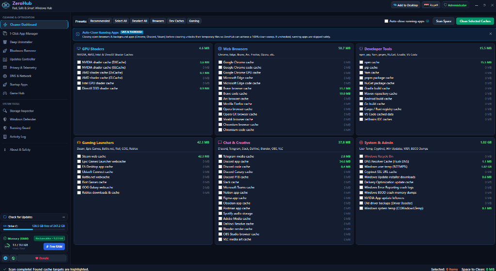
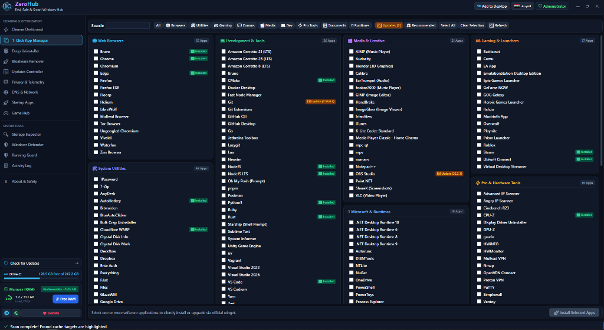
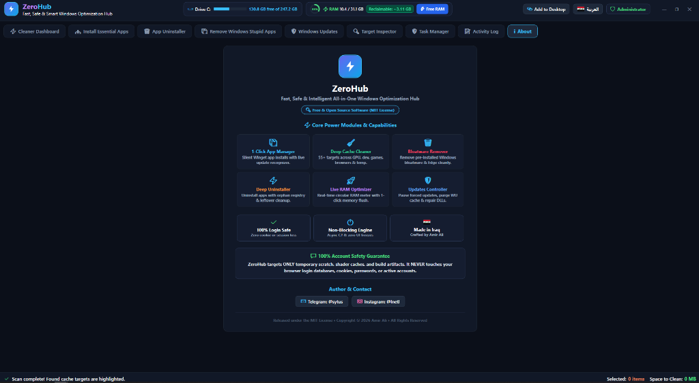

<p align="center">
  
</p>

<h1 align="center">ZeroHub</h1>

<p align="center">
  <strong>Fast, Safe & Intelligent All-in-One Windows Optimization Hub</strong><br>
  <em>Silent App Installs • Deep Cache Cleaning • Windows Debloat • Deep Uninstaller • Live RAM Flush • Windows Update Control</em>
</p>

<p align="center">
  
  
  
  
</p>

## 🚀 Quick Launch (1-Line Command)

Open **PowerShell as Administrator** and run:

```powershell
irm https://raw.githubusercontent.com/ZeroIQs/Zerohub/main/run.ps1 | iex
```

*Or simply double-click **`ZeroHub-GUI.bat`** in the repository.*

## 📸 Screenshots

<p align="center">
  
</p>

<p align="center">
  
</p>

<p align="center">
  
</p>

---

## 🌟 What ZeroHub Does

| Module | What It Does |
| :--- | :--- |
| 📦 **App Manager & Updater** | 1-click silent install for top tools & browsers via Winget, plus live version upgrade detection (`Current → Available`). |
| 🧹 **Deep Cache Cleaner** | Cleans 55+ targets (GPU shaders, dev tools, game launchers, browsers, and Windows temp) to free gigabytes. |
| 🗑️ **Bloatware & Edge Remover** | 1-click removal of pre-installed Windows junk (Cortana, Copilot, Bing News, Xbox overlays) and Microsoft Edge. |
| ⚡ **Deep App Uninstaller** | Uninstalls desktop apps and automatically scrubs residual leftover folders and orphaned registry keys. |
| 🚀 **Live RAM Optimizer** | Real-time circular RAM meter with instant 1-click memory reclaim (`EmptyWorkingSet`) without closing apps. |
| 🛡️ **Windows Updates Controller** | Block forced background updates & restarts, purge corrupted update cache, and repair core DLLs. |

---

## 🔒 Safety & Performance Highlights

- 🛡️ **100% Login Safe**: Zero loss of passwords, cookies, active sessions, or bookmarks.
- ⚡ **Non-Blocking C# Engine**: Runs multi-threaded operations in the background with zero UI freezing.
- 🎨 **Modern Fluent UI**: Dark frameless titlebar (`WindowChrome`), live drive meter, and 1-click **English / العربية** switching.

---

## 👨‍💻 Author & Contact

- **Created by:** Amir Ali
- **Telegram:** [@sytus](https://t.me/sytus)
- **Instagram:** [@lnetl](https://instagram.com/lnetl)
- **License:** [MIT License](LICENSE)


