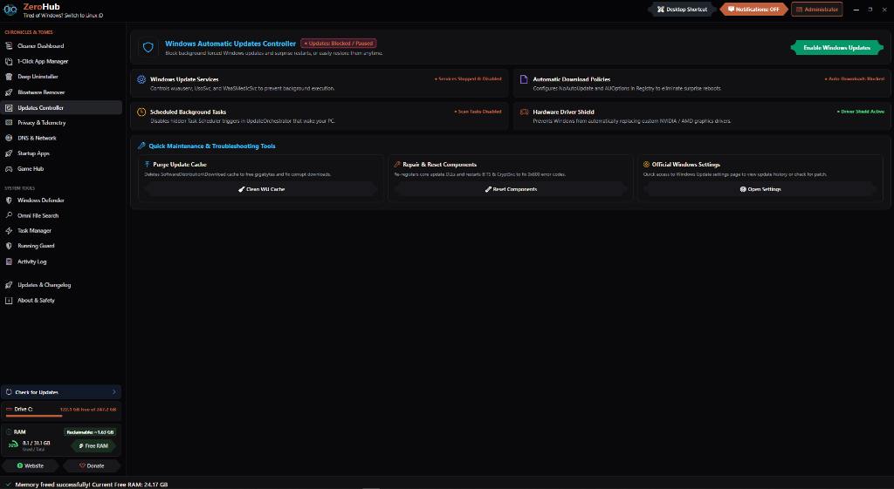

<p align="center">
  <a href="https://zeroiq.site/" target="_blank">
    
  </a>
</p>

<h1 align="center">ZeroHub</h1>

<p align="center">
  <strong>Fast, Safe & Intelligent All-in-One Windows Optimization Hub</strong><br>
  <em>Silent App Installs • Deep Cache Cleaning • Windows Debloat • Deep Uninstaller • Live RAM Flush • Windows Update Control • Game Hub • Startup Manager • Privacy Hardener</em>
</p>

<p align="center">
  
  
  
  
  
  <a href="https://zeroiq.site/donate" target="_blank"></a>
</p>

## 🚀 Quick Launch (1-Line Command)

Open **PowerShell as Administrator** and run:

```powershell
irm https://raw.githubusercontent.com/ZeroIQs/Zerohub/main/run.ps1 | iex
```

*Or simply double-click **`ZeroHub-GUI.bat`** in the repository.*

## 📸 Screenshots

<p align="center">
  
</p>

<p align="center">
  
</p>

<p align="center">
  
</p>

<p align="center">
  
</p>

---

## 🌟 What ZeroHub Does

| Module | What It Does |
| :--- | :--- |
| 📦 **App Manager & Updater** | 1-click silent install for 100+ top tools & browsers via Winget, plus live version upgrade detection (`Current → Available`) with in-tab updates. |
| 🧹 **Deep Cache Cleaner** | Cleans 55+ targets (GPU shaders, dev tools, game launchers, browsers, and Windows temp) to free gigabytes of wasted disk space. |
| 🗑️ **Bloatware & Edge Remover** | 1-click removal of pre-installed Windows junk (Cortana, Copilot, Bing News, Xbox overlays) and Microsoft Edge. |
| ⚡ **Deep App Uninstaller** | Uninstalls desktop apps and automatically scrubs residual leftover folders and orphaned registry keys. |
| 🚀 **Live RAM Optimizer** | Real-time circular RAM meter with instant 1-click memory reclaim (`EmptyWorkingSet`) without closing apps. |
| 🛡️ **Windows Updates Controller** | Block forced background updates & restarts, purge corrupted update cache, and repair core DLLs. |
| 🎮 **Game Hub** | Auto-detects installed games from Steam, Epic, Riot, Xbox/MS Store, GOG, FitGirl & DODI repacks with official cover art from Steam CDN. Filter by platform, search, add custom games. |
| ⚙️ **Startup & Services Manager** | View, enable, or disable startup programs and Windows services to speed up boot time with instant COM inspection. |
| 🔒 **Privacy & Telemetry Hardener** | 12-vector protection suite: block telemetry services, stop P2P update seeding (WUDO), disable in-OS ads & setup nags, keep clipboard strictly local, null-route tracking hosts, and disable AI/Recall telemetry with 1-click Max Privacy mode. |
| 🪟 **Classic Context Menu** | 1-click toggle to restore the instant-response full Windows 10 right-click menu on Windows 11 with auto-refreshing Explorer. |
| 🔍 **Omni File & Text Finder** | Multi-threaded C# parallel search engine for blazing-fast filenames, folders, and inside-file text searches (`.ini`, `.cfg`, `.log`, `.txt`, `.json`, `.ps1`, `.py`, `.cs`, `.cpp`). |
| ⚡ **Smart Process Manager** | Real-time process explorer with 4-tier safety classification (`Safe to Stop`, `Caution`, `Hardware`, `Critical System`), 1-click batch safe task purging, and protected locks against system crashes. |
| 🛡️ **Running Guard** | Real-time process watchdog that monitors active background tasks, detects bloatware, and auto-terminates unwanted telemetry processes. |

---

## 🔒 Safety & Performance Highlights

- 🛡️ **100% Login & Account Safe**: Zero loss of passwords, cookies, active browser sessions, or bookmarks.
- 🔍 **Safe Read-Only Omni Search**: File & content indexing operates in strict read-only mode to prevent accidental file changes.
- 🛡️ **Protected Process Watchdog**: Running Guard only monitors and terminates telemetry/bloatware, with protected filters for essential Windows system services.
- 🪟 **100% Reversible System Tweaks**: All privacy policies, context menu modifications, and Windows Update tweaks have 1-click instant restore toggles.
- ⚡ **Non-Blocking C# Engine**: Runs multi-threaded operations in the background with zero UI freezing.
- ✈️ **100% Offline Capable**: Desktop shortcuts launch locally with zero delays, running completely without an internet connection.
- 🎨 **Modern Fluent UI**: Dark frameless titlebar (`WindowChrome`), live drive meter, and real-time circular RAM metrics.
- 🔧 **PowerShell 5.1 & 7 Compatible**: Compiles cleanly on both Windows PowerShell and pwsh 7.x with graceful compile-failure guards.
- 🌍 **100% Portable**: No personal data, no hardcoded paths — runs on any Windows 10 & 11 PC out of the box.

---

## 💖 Support & Donate

If you find **ZeroHub** helpful and want to support ongoing updates and new features, consider buying a coffee or donating to the project!

<p align="center">
  <a href="https://zeroiq.site/donate" target="_blank">
    
  </a>
</p>

---

## 👨‍💻 Author & Contact

- **Website:** <a href="https://zeroiq.site/" target="_blank" rel="noopener noreferrer">zeroiq.site</a>
- **Donate:** <a href="https://zeroiq.site/donate" target="_blank" rel="noopener noreferrer">zeroiq.site/donate</a>
- **Created by:** Amir Ali
- **License:** [GNU GPLv3](LICENSE)
